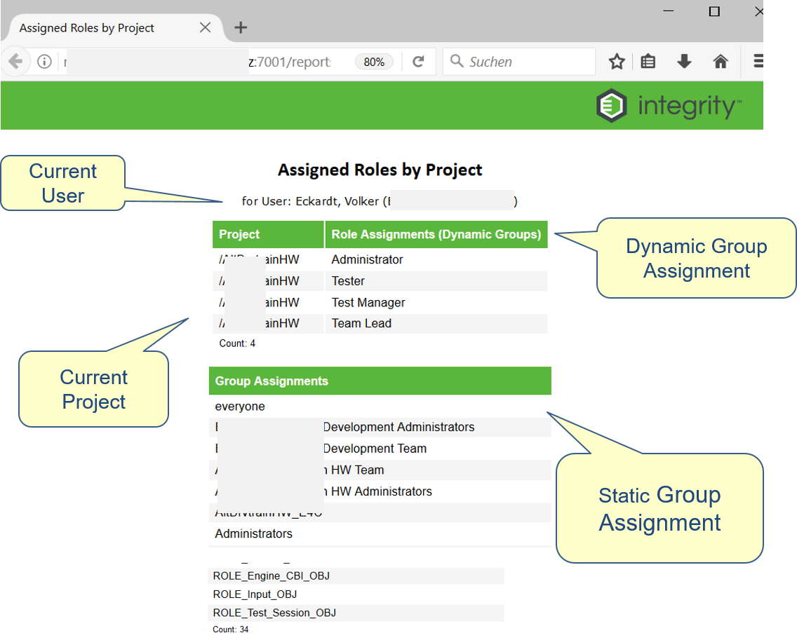

# Report "Assigned Roles by Project"
This reports lists all Dynamic and Static Groups for the current user and the selected item

# User Story
The following User Stories are covered
- As a User I want to see to which Roles and Groups I am assigned to, respecting the current project that I have selected.
- As an Administrator I want to review to which Roles and Groups a specific user is assigned to 

# Report Layout


# How to Install
Perform the following steps to install this report:
- copy the vbs Script into your local IntegrityClient/bin directory
```
bin\runReport.vbs
```
- create a custom menu according to the following definition

```
Name:        Assigned Roles by Project
Program:     wscript
Parameters:  runReport.vbs  "Assigned Roles by Project"
Description: Opens a Report to show the Assigned Roles by Project for the current user
```
- copy the server files into the corresponding directories

```
public_html\reports\AssignedRolesbyProject.jsp  (new)
public_html\reports\css\integritydocs.css  (new)
public_html\reports\css\sorttable.js  (new)
public_html\reports\images\ptc_integrity_logo.png  (new)
reports\recipes\AssignedRolesbyProject.rpt (new) 
```
- create a new report with the following data:
```
Name:       Assigned Roles by Project
Template:   the provided rpt file: AssignedRolesbyProject.rpt
Query:      Item Based Report Selection
```

- A default User ID must be set in the JSP script. I was hoping to find a way to get the User ID dynamically, but I had no success. Use the command "im users --fields=id,name" to get a valid ID from a system user who can view group details. This can be a user who is often also an integration account with admin read rights.


## How To Test
- Select any item or open any item of your choice
- Start the report by choosing (M) Custom > Assigned Roles by Project

## Programming Language
- Integrity Report
- Integrity Beans
- JSP with embedded Java

## Programming Environment 
You need the following editor to develop this solution:
- Any Text Editor  (I am using always NetBeans :)

## Notes 
- This is my first report where I am using Integrity Beans to create an administrative report. The interesting thing is that this just works (almost). The beauty is that the performance is amazingly fast, because the Beans are already loaded into the memory (I am talking about the Beans that are usually only used by triggers).
- Unfortunately, I had to add another local VBS script to catch the current user, haven't found a better way to do this: A report don't know which user has executed it ;( 
- If you drop the project parameter completely from the jsp link, then you will see all projects where the user has any dynamic group assigned to, and which role(s) he has in that projects 
- You can sort the output by clicking at the green table headers (thanks to sorttable.js)
- I can't get the description for the groups, because the IntegrityBean don't has that information ;( 
- If you are experiencing any issue, then also inspect the Server.Log 


## Open Issues
The following issues are known:
- The Group Lists are not sorted yet
- A normal user can change the parameters, and can view any users details (this might be solved by using https)
- In Firefox and Chrome the layout looks perfect, in IE it looks a bit "different" 
